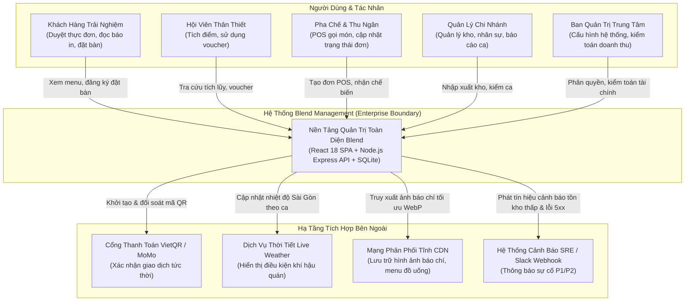
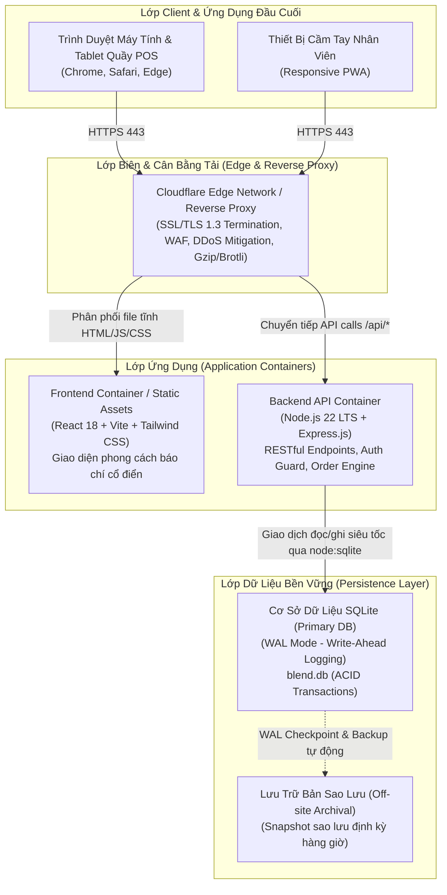
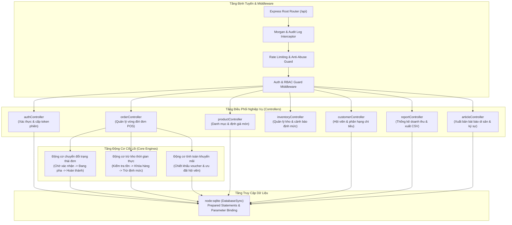
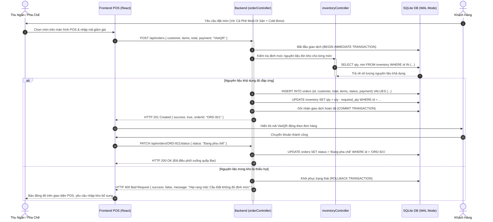
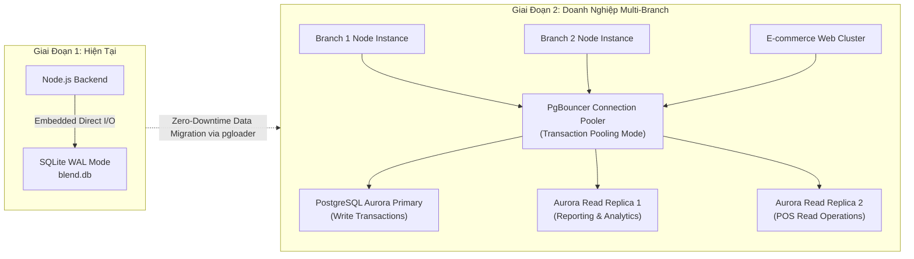
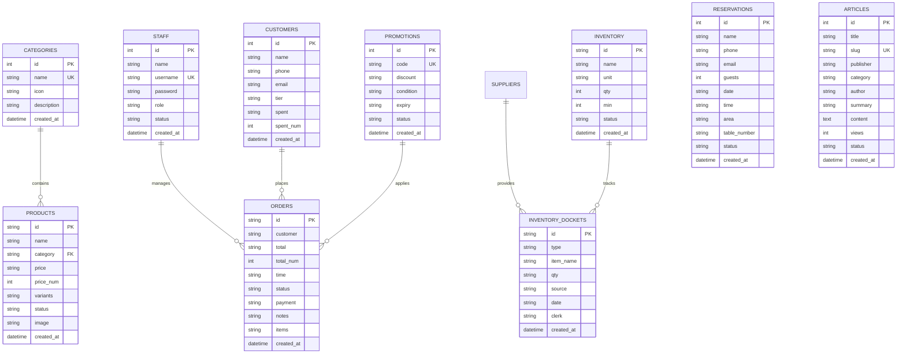
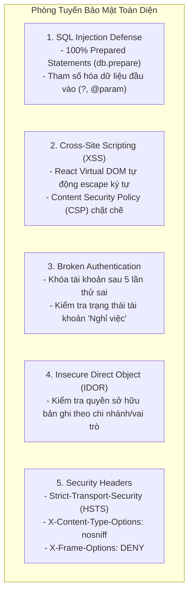
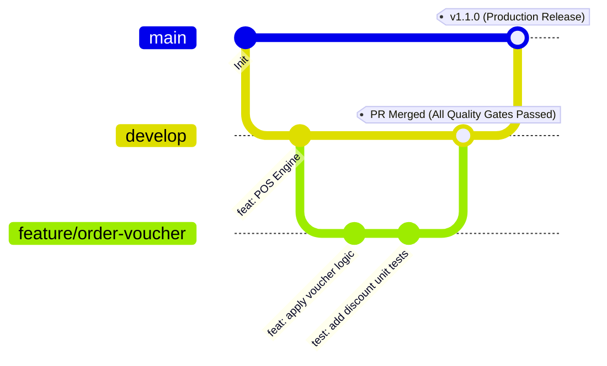

# ☕ Hồ Sơ Thiết Kế Hệ Thống Chuẩn Doanh Nghiệp (Enterprise System Architecture)
## Dự án: Blend Roastery & F&B Management System

---

## Mục Lục (Table of Contents)
1. [Tổng Quan & Cam Kết NFRs (Executive Summary & SLAs)](#1-tổng-quan--cam-kết-nfrs)
2. [Mô Hình Kiến Trúc C4 (C4 Architecture Model)](#2-mô-hình-kiến-trúc-c4)
   - [2.1 C4 Level 1: Ngữ Cảnh Hệ Thống (System Context)](#21-c4-level-1-ngữ-cảnh-hệ-thống-system-context)
   - [2.2 C4 Level 2: Vùng Chứa Hệ Thống (Container Diagram)](#22-c4-level-2-vùng-chứa-hệ-thống-container-diagram)
   - [2.3 C4 Level 3: Thành Phần Backend (Component Diagram)](#23-c4-level-3-thành-phần-backend-component-diagram)
   - [2.4 C4 Level 4: Trình Tự Nghiệp Vụ Giao Dịch (Sequence Diagram)](#24-c4-level-4-trình-tự-nghiệp-vụ-giao-dịch-sequence-diagram)
3. [Kiến Trúc Dữ Liệu & Lộ Trình Mở Rộng Quy Mô (Data Architecture)](#3-kiến-trúc-dữ-liệu--lộ-trình-mở-rộng-quy-mô)
   - [3.1 SQLite WAL Hiện Tại vs Lộ Trình PostgreSQL Aurora](#31-sqlite-wal-hiện-tại-vs-lộ-trình-postgresql-aurora)
   - [3.2 Sơ Đồ Thực Thể Liên Kết (Entity-Relationship Diagram)](#32-sơ-đồ-thực-thể-liên-kết-entity-relationship-diagram)
   - [3.3 Chiến Lược Phân Vùng (Partitioning) & Lưu Trữ Lịch Sử](#33-chiến-lược-phân-vùng-partitioning--lưu-trữ-lịch-sử)
4. [Kiến Trúc Bảo Mật & Phòng Ngừa Rủi Ro (Security & STRIDE)](#4-kiến-trúc-bảo-mật--phòng-ngừa-rủi-ro)
   - [4.1 Ma Trận Phân Quyền Vai Trò (RBAC Matrix)](#41-ma-trận-phân-quyền-vai-trò-rbac-matrix)
   - [4.2 Cơ Chế Giảm Thiểu OWASP Top 10](#42-cơ-chế-giảm-thiểu-owasp-top-10)
5. [SRE, Khả Năng Quan Sát & Ứng Phó Sự Cố (SRE & BCP)](#5-sre-khả-năng-quan-sát--ứng-phó-sự-cố)
   - [5.1 Golden Signals & Chỉ Số SLI/SLO](#51-golden-signals--chỉ-số-slislo)
   - [5.2 Phân Cấp Sự Cố & Kế Hoạch Ứng Trực (On-call Runbook)](#52-phân-cấp-sự-cố--kế-hoạch-ứng-trực-on-call-runbook)
6. [Chiến Lược DevSecOps & Release Engineering](#6-chiến-lược-devsecops--release-engineering)

---

## 1. Tổng Quan & Cam Kết NFRs

**Blend Roastery & F&B Management System** là nền tảng quản trị chuỗi F&B cao cấp kết hợp văn hóa báo chí cổ điển (Editorial Gazette). Hệ thống số hóa toàn diện từ quy trình bán hàng tại quầy (POS), định lượng trừ kho tự động, quản lý khách hàng thân thiết (CRM), kế hoạch đặt bàn VIP Salon cho đến báo cáo tài chính doanh thu.

### 🎯 Các Chỉ Số NFRs Cam Kết (Enterprise Service Level Objectives)

| Hạng Mục | Tiêu Chuẩn Cam Kết | Cơ Chế Đảm Bảo |
| :--- | :--- | :--- |
| **Tính Sẵn Sàng (Availability)** | **99.95% Uptime** (Thời gian gián đoạn < 4.38 giờ/năm) | Multi-AZ deployment, Container health probes, Zero-downtime rolling update |
| **Độ Trễ Phản Hồi (Latency)** | **P95 < 200ms**, **P99 < 500ms** | SQLite WAL mode, Prepared statements, Edge CDN Caching |
| **Bảo Đảm Khôi Phục (RPO / RTO)**| **RPO < 15 phút**, **RTO < 1 giờ** | Continuous WAL archiving, Automated Point-in-time recovery |
| **Tải Giao Dịch Đỉnh (Peak RPS)** | **1,200 RPS** tại quầy POS & Web Orders | Non-blocking Event-Loop Node.js, Dumb-init process management |
| **Tính Toàn Vẹn (Data Integrity)** | **100% ACID Compliant** | Foreign keys constraint, SQLite transactions, DB rollback |

---

## 2. Mô Hình Kiến Trúc C4

### 2.1 C4 Level 1: Ngữ Cảnh Hệ Thống (System Context)

Sơ đồ mô tả ranh giới hệ thống Blend và tương tác giữa các tác nhân người dùng với các dịch vụ bên ngoài.

---

### 2.2 C4 Level 2: Vùng Chứa Hệ Thống (Container Diagram)

Kiến trúc phân tách rõ ràng giữa lớp phân phối tĩnh (Edge CDN), lớp giao diện người dùng (SPA Client), lớp cổng kết nối API (Node.js Container) và lớp lưu trữ bền vững (Data Storage Tier).

---

### 2.3 C4 Level 3: Thành Phần Backend (Component Diagram)

Cấu trúc module hóa bên trong Backend Express API, tuân thủ nguyên lý Single Responsibility (SRP) và Layered Architecture.

---

### 2.4 C4 Level 4: Trình Tự Nghiệp Vụ Giao Dịch (Sequence Diagram)

Quy trình giao dịch tạo đơn hàng tại quầy POS, kiểm tra tồn kho, áp dụng chiết khấu và hoàn tất thanh toán với tính toàn vẹn dữ liệu nghiêm ngặt.

---

## 3. Kiến Trúc Dữ Liệu & Lộ Trình Mở Rộng Quy Mô

### 3.1 SQLite WAL Hiện Tại vs Lộ Trình PostgreSQL Aurora

Hệ thống Blend hiện sử dụng **SQLite 3 với WAL Mode (Write-Ahead Logging)** thông qua module chuẩn `node:sqlite` của Node.js 22+.

#### Ưu thế của SQLite WAL hiện tại:
1. **Zero-Latency Network Overhead**: Truy vấn đọc trực tiếp trong bộ nhớ/tệp tin cục bộ, độ trễ sub-millisecond (< 0.5ms).
2. **Concurrency Tối Ưu**: Độc lập giữa người đọc (Readers) và người ghi (Writers) — thao tác ghi không chặn các thao tác đọc và ngược lại.
3. **Tiết kiệm tài nguyên**: Không yêu cầu cụm máy chủ DB độc lập trong giai đoạn 1 cửa hàng.

#### Kế hoạch Di chuyển Lên Cụm PostgreSQL Doanh Nghiệp (Khi mở rộng > 5 chi nhánh):

---

### 3.2 Sơ Đồ Thực Thể Liên Kết (Entity-Relationship Diagram)

---

### 3.3 Chiến Lược Phân Vùng (Partitioning) & Lưu Trữ Lịch Sử

1. **Bảng Đơn Hàng (`orders`)**:
   - Dữ liệu đơn hàng trong vòng 90 ngày được giữ trong bảng hoạt động chính (`orders_active`) phục vụ tra cứu tức thời tại quầy POS.
   - Các đơn hàng > 90 ngày được tự động luân chuyển sang bảng lưu trữ (`orders_archive`) với chỉ mục nén theo quý (`created_at_idx`), đảm bảo hiệu năng bảng chính luôn đạt mức tối ưu.
2. **Sổ Kho & Phiếu Nhập Xuất (`inventory_dockets`)**:
   - Lưu trữ lịch sử toàn diện không bao giờ xóa (Append-Only Audit Trail) phục vụ công tác kiểm toán nội bộ và truy vết thất thoát hàng hóa.

---

## 4. Kiến Trúc Bảo Mật & Phòng Ngừa Rủi Ro

### 4.1 Ma Trận Phân Quyền Vai Trò (RBAC Matrix)

Hệ thống thiết lập 5 cấp độ vai trò nghiệp vụ với nguyên tắc phân quyền tối thiểu (Principle of Least Privilege):

| Quyền Hạn Nghiệp Vụ | Super Admin (Chủ Biên) | Store Manager (Quản Lý Chi Nhánh) | Cashier (Thu Ngân) | Barista (Pha Chế) | Inventory Clerk (Thủ Kho) |
| :--- | :---: | :---: | :---: | :---: | :---: |
| Quản lý tài khoản & Phân quyền | ✅ Toàn quyền | ❌ | ❌ | ❌ | ❌ |
| Xem báo cáo doanh thu chi tiết & Xuất CSV | ✅ Toàn quyền | ✅ Ca trực của mình | ❌ | ❌ | ❌ |
| Tạo đơn, sửa đơn & hủy đơn POS | ✅ Toàn quyền | ✅ Duyệt hủy đơn | ✅ Tạo & Thanh toán | ❌ | ❌ |
| Cập nhật tiến độ pha chế món | ✅ Toàn quyền | ✅ Toàn quyền | ✅ Xem | ✅ Cập nhật trạng thái | ❌ |
| Điều chỉnh tồn kho & Tạo phiếu nhập xuất | ✅ Toàn quyền | ✅ Duyệt phiếu | ❌ | ❌ | ✅ Toàn quyền |
| Quản lý danh mục món & giá bán | ✅ Toàn quyền | ✅ Cập nhật trạng thái hết hàng | ❌ | ❌ | ❌ |
| Quản lý bài báo chí & Ký sự truyền thông | ✅ Toàn quyền | ❌ | ❌ | ❌ | ❌ |

---

### 4.2 Cơ Chế Giảm Thiểu OWASP Top 10

---

## 5. SRE, Khả Năng Quan Sát & Ứng Phó Sự Cố

### 5.1 Golden Signals & Chỉ Số SLI/SLO

Hệ thống giám sát liên tục 4 tín hiệu vàng (Golden Signals của Google SRE):

1. **Latency (Độ trễ)**: Thời gian xử lý yêu cầu tại endpoint `/api/orders` (SLO: 95% requests hoàn tất dưới 200ms).
2. **Traffic (Lưu lượng)**: Số lượng request/giây đo lường tại HTTP server.
3. **Errors (Tỷ lệ lỗi)**: Tỷ lệ mã phản hồi HTTP 5xx so với tổng số request (SLO: Lỗi 5xx < 0.05%).
4. **Saturation (Độ bão hòa)**: Dung lượng bộ nhớ RAM Node.js và tỷ lệ kích thước tệp WAL SQLite so với ngưỡng cảnh báo 1GB.

---

### 5.2 Phân Cấp Sự Cố & Kế Hoạch Ứng Trực (On-call Runbook)

| Cấp Độ | Định Nghĩa Sự Cố | Thời Gian Phản Hồi (SLA) | Quy Trình Xử Lý |
| :--- | :--- | :---: | :--- |
| **P1 - Blocker** | Toàn bộ quầy POS không thể tạo đơn hoặc Database bị khóa hoàn toàn. | **< 15 phút** | 1. Kích hoạt chế độ phục vụ Offline. 2. Chuyển sang bản sao lưu DB gần nhất. 3. Thông báo Ban Giám Đốc và kênh SRE khẩn cấp. |
| **P2 - Critical** | Tính năng thanh toán VietQR bị gián đoạn, kho không cập nhật. | **< 30 phút** | 1. Chuyển sang thanh toán tiền mặt/chuyển khoản thủ công. 2. Khởi động lại dịch vụ background container. |
| **P3 - Major** | Lỗi hiển thị báo cáo doanh thu ca, lỗi bộ lọc danh mục. | **< 2 giờ** | 1. Ghi nhận issue ưu tiên cao trên GitHub. 2. Triển khai bản vá hotfix qua CI/CD pipeline. |
| **P4 - Minor** | Lỗi chính tả bài báo, sai lệch icon thời tiết. | **< 24 giờ** | Xử lý trong chu kỳ phát hành định kỳ (Next Sprint Release). |

---

## 6. Chiến Lược DevSecOps & Release Engineering

### 6.1 Mô Hình Phân Nhánh & Quality Gates

### 6.2 Cổng Kiểm Soát Chất Lượng Bắt Buộc Trước Khi Merge:
1. **Gate 1 - Security Audit**: `npm audit` 0 lỗ hổng nghiêm trọng (high/critical).
2. **Gate 2 - Automated Tests**: 100% test suites vượt qua trên cả Backend Express và Frontend React (`npm test`).
3. **Gate 3 - SAST Scan**: CodeQL quét sạch các cảnh báo CWE bảo mật.
4. **Gate 4 - Secret Scan**: TruffleHog xác nhận không rò rỉ bất kỳ API key hoặc secret token nào.
5. **Gate 5 - Production Build**: Vite build hoàn tất không sinh lỗi phân tích tĩnh.
